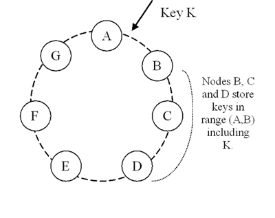
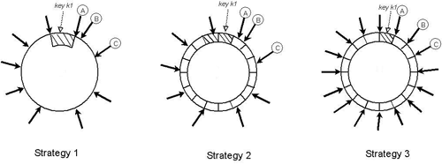

# Amazon Dynamo

[ymtszw](https://twitter.com/gada_twt)

---

## References

- [Amazon CTOのブログ](http://www.allthingsdistributed.com/)
    - [A Decade of Dynamo](http://www.allthingsdistributed.com/2017/10/a-decade-of-dynamo.html)
        - Amazon Dynamoは2017年11月で10周年を迎えた
    - [Amazon's Dynamo](http://www.allthingsdistributed.com/2007/10/amazons_dynamo.html) - 原論文
        - [PDF版](http://www.allthingsdistributed.com/files/amazon-dynamo-sosp2007.pdf)
    - [Amazon DynamoDB](http://www.allthingsdistributed.com/2012/01/amazon-dynamodb.html) - DynamoDBのデビュー

---

## [Dynamo: Amazon’s Highly Available Key-value Store](http://www.allthingsdistributed.com/files/amazon-dynamo-sosp2007.pdf)

- まず、<u>**DynamoとDynamoDBは別物。**</u>
- Dynamoは:
    - シンプルなKey-Value Store (KVS)である
    - Amazon内製の、trusted environment向けのhighly-available systemである
    - Amazon (Web Services)の様々なサービス内部で利用されているコンポーネントである
- SOSP(Symposium on Operating Systems Principles) 2007に採択された論文に、背景・理論・実装等詳しく紹介されている
- ここでは論文の内容を一通りまとめる
    - <small>Giuseppe DeCandia, Deniz Hastorun, Madan Jampani, Gunavardhan Kakulapati, Avinash Lakshman, Alex Pilchin, Swami Sivasubramanian, Peter Vosshall and Werner Vogels,
      "Dynamo: Amazon's Highly Available Key-Value Store", in the Proceedings of the 21st ACM Symposium on Operating Systems Principles, Stevenson, WA, October 2007.</small>

---

# Background and Related Works

----

## Background

- 従来のRDBMSはAmazon級のワークロードには最適でない（2007年当時）
    - 複雑なクエリシステムを必要としないマイクロサービスが多い（KVSへの適性）
    - 複雑高機能なRDBMSは往々にして高価なH/Wと高い技術を持った運用者を要する
    - Replication能力が限定されており、かつconsistency over availability戦略を採用しがち
    - Scale-outが苦手で、load-balancingのための賢いpartitioningを導入するのも難しい

<u>Dynamoはこれらの問題点を解決するためのAmazonの解答の一つ</u>

----

## System Assumptions and Requirements

- Query Model: 単純なKVS
    - Unique key, blob value
    - No operations span multiple data items; no need for relational schema
    - 比較的小さな（< 1MB）オブジェクトサイズ
- ACID Properties: No Isolation, Give up Consistency for high availability*
    - Isolationを提供しないというのはともかく、原論文のconsistency (the "C" in ACID) に関する記述はCAPのCと明らかに混同している気がする
- Efficiency: Works with commodity H/W, meets 99.9th-percentile-based SLA
- Other:
    - Runs in trusted environment, no authentication/authorization
    - マイクロサービス毎に独立したDynamo instance（＝クラスタ）

----

## SLA; Service Level Agreement

- Amazonのサービスアーキテクチャは複雑
    - ECサイトの1ページをロードするために150以上のマイクロサービス呼び出し
    - 個々のサービスがさらにdependencyをもち、多階層になる
- それぞれのサービスがサービス間SLAを互いに厳守することが不可欠
- Mean/Median/VarianceベースのSLAは、
    - Amazon級のサイトで、
    - ピークタイムにも、
    - パーソナライズされた体験を、
    - 全ての利用者に提供するためには<u>不足</u>

----

## 99.9th percentile SLA

- Amazonでは99.9th percentileで全てのSLAを締結し、パフォーマンスを計測する
    - 99.9%という値はcost-benefit analysisを元に選択された基準
- Amazonの商用環境はこのSLA基準がbetter overall (customer) experienceを示すことを実際に観測している
- このSLAを満たすにあたって、ビジネスロジックが比較的軽量なケース（Amazonに置いて一般的）では、**storage system/state managementこそが主なポイント**（律速段階）になる

----

## Design Considerations

- 従来（2007年当時）の（replication可能な）商用DBシステムでは、
    - strongly consistentなデータアクセスを提供するために、
    - 同期的なreplica coordinationを行うことが多く、
    - トレードオフとして特定のfailure caseではavailabilityを犠牲にする事が多かった。（writeを受理しないなど）
        - おなじみの[CAP定理](https://www.wikiwand.com/en/CAP_theorem)
- HAを目指すためにoptimisticなアプローチ、eventually consistentという考え方が生まれる
- 最低限のreplicaが応答した時点でwriteを受け付け、backgroundで全てのreplicaに変更を伝搬する
    - 問題は、不可避的に生じるupdate conflictをどう解決するか
        - いつ解決するか
        - 誰が解決するか

----

## _When_ to resolve conflict

- 従来のdistributed storage systemでは<u>resolve on write</u>アプローチが多かった
    - Writeされたデータはconflictしていないことを確約、read操作を軽量に
    - **All (or Majority of) replica must be reachable on write** が条件であることが多い
    - したがってunreachable replicaが生じるようなfailure caseではwrite不能になる
- Dynamoは<u>**Always Writable**</u> availabilityを目指す
    - Amazonの多くのサービスでは、肝心なときにwriteが拒否されるdata storeはcustomer experienceを低下させる
    - この設計思想により、conflict resolutionのタイミングを<u>**read側に押しやる**</u>

----

## _Who_ performs resolutions

- 実際のresolutionは、
    - storage system自体が行う、or
    - 呼び出し側applicationが行う
- 2通り考えられる
    - 前者の枠組みでできることは限られる。全てこちらでやろうとすると、例えば[Last-Write-Winsなどのfundamentally unsafeな手法](https://aphyr.com/posts/285-jepsen-riak)に頼ることになりかねない
    - 一方呼び出し側applicationは、データのもつ意味を知っており、conflictするデータを適切にマージできる柔軟性がある
        - ただし、application developerがresolution logicを記述しなければならない
- Dynamoは両者を混合したアプローチを取る

----

## Other key principles

- Symmetry:
    - Dynamo nodeにはleader/followerやmaster/slaveといった関係がなく、すべてのnodeは同じ機能と責任を持つ
    - provisioning/maintenanceを簡潔化する
- Decentralization:
    - Symmetryの延長として、システムはいかなる「中央」も持たない
- Heterogeneity:
    - 不均一なH/Wを導入可能で、load distributionは各serverの性能に比例する

----

## Related Works

- P2P systems
    - [Freenet](https://www.wikiwand.com/en/Freenet), [Gnutella](https://www.wikiwand.com/en/Gnutella): 主にファイル共有に使われる系。
    - 発展した[Pastry](https://kelehers.me/others/pastry.pdf), [Chord][1]は要求データを持つノードに到達するためのhop数を上界で抑える。
    - $O(1)$でroutingするvariationもあり、[Oceanstore](http://oceanstore.cs.berkeley.edu/)や[PAST](http://rowstron.azurewebsites.net/PAST/hotos.pdf)などはその上に構成される
- DFS and DBs
    - [Ficus](https://www.isi.edu/~johnh/PAPERS/Reiher94a.pdf), [Coda][2]: Consistencyを犠牲にhigh-availablilityを目指すreplicated file system。
    - MSResearchの[Farsite](https://www.microsoft.com/en-us/research/publication/farsite-federated-available-and-reliable-storage-for-an-incompletely-trusted-environment/): 加えてdecentralizedなfile system。さらにByzantine。
    - おなじみGoogleの[GFS](https://static.googleusercontent.com/media/research.google.com/ja//archive/gfs-sosp2003.pdf)。でもmasterがあるのでcentralized。
    - [Bayou](https://people.eecs.berkeley.edu/~brewer/cs262b/update-conflicts.pdf): Distributed RDBMS
    - [FAB](http://citeseerx.ist.psu.edu/viewdoc/download?doi=10.1.1.103.6213&rep=rep1&type=pdf): Distributed block storage system
    - [Antiquity](http://oceanstore.cs.berkeley.edu/publications/papers/pdf/antiquity06.pdf): Wide-area distributed storage system. Byzantine.
    - やはりおなじみGoogleの[BigTable](https://static.googleusercontent.com/media/research.google.com/ja//archive/bigtable-osdi06.pdf)。

[1]: https://www.wikiwand.com/en/Chord_(peer-to-peer)
[2]: https://www.wikiwand.com/en/Coda_(file_system)

Note: Partition-tolerantなのはBayou, Ficus, Coda

----

## Dynamo vs. Related Works

- Network Partition Tolerance
- Always Writable
- Weak (eventual) consistency
- Works on a single administrative (trusted) domain
    - Authentication/authorizationは議論しない
    - Byzantineまでは考えない
    - Hierarchical namespaceとかも不要（マイクロサービス毎にDynamoを立てればいい）
- Simple Key/Value interface, no complex relational schema
    - BigTableのようにmulti-dimensional dataへの複雑なqueryとかいらない
- SLA: Few hundredth milliseconds of read and write for 99.9%-ile
    - No multi-hop routing => "Zero-hop DHT"

---

# Architecture

----

## The Architecture

<small>

| Problem | Technique | Advantage |
| ------- | --------- | --------- |
| Partitioning | Consistent Hashing | Incremental Scalability |
| High Availability for writes | Vector clocks with reconciliation during reads | Version size is decoupled from update rates. |
| Handling temporary failures | Sloppy Quorum and hinted handoff | Provides high availability and durability guarantee when some of the replicas are not available. |
| Recovering from permanent failures | Anti-entropy using Merkle trees | Synchronizes divergent replicas in the background. |
| Membership and failure detection | Gossip-based membership protocol and failure detection. | Preserves symmetry and avoids having a centralized registry for storing membership and node liveness information. |

</small>

----

## Interface

- シンプルなKVSとして、`get()`と`put()`しか持たない
- `get(key)`
    - `key`を元に対象のreplica群を特定し、
        - 単一のobject、もしくは、
        - conflictしているobjectのリストと、`context`情報を返す
- `put(key, context, object)`
    - keyを元にobjectのreplicaがどこに保存されるべきか決定し、nodeのディスクに書き込む
    - deleteも`put()`で表現
- `context`はcallerに依存するシステムメタデータ
    - objectのバージョンや最適化のための情報などを含む
    - `put()`時にはobjectと一緒に保存される
- keyのMD5 hashを元に取扱いnodeは決定される

----

## Partitioning

- <u>**Incremental-scaleすること**</u>が何より重要
- [Consistent hashing](https://www.cs.princeton.edu/courses/archive/fall09/cos518/papers/chash.pdf)を採用して負荷を分散
    - Output range of a hash function is treated as a fixed circular space or “ring”
    - ハッシュの最大値の次の値はハッシュの最小値とする
    - Cf. [Rendezvous Hashing](http://www.eecs.umich.edu/techreports/cse/96/CSE-TR-316-96.pdf)
- 各nodeはhash ring内のランダムな値を位置として与えられる
- 一つのデータについて、keyのhashを元にやはりhash ring内の位置が決まる
    - そこから<u>**時計回りにhash ringを辿って、最初に行き会ったnodeを第一の担当nodeとする**</u>
    - つまりあるnodeは、ring上で（時計回りに見たとき）一つ手前にあたるnodeと自身との間のring領域に属するkeyを持つデータの保管を担当する
        - この半開区間をkey rangeあるいはpartitionという
    - この方式の利点は、1 nodeの進退が影響するのが直接隣接する2 nodesのみに抑えられる点

----

## Partitioning

- すぐさま現れるchallenges:
    - Hash ring上におけるnode positioningがランダムだと、負荷分散が明らかに一様にならない
    - 構成するnodesはheterogeneousであることを考慮していない
- <u>**Virtual nodes (vnodes)**</u>という仕組みを導入して対応
    - 物理的な1 nodeに対して、複数のring上のposition（= virtual nodes, tokensとも）を担当させる
    - ある物理nodeがunavailableになったとき、そのnodeが担当していたloadは自然とhash ring上の広い範囲（virtual nodesのある周辺）に分散する
        - E.g. Virtual nodes x 5を担当する物理nodeが死んだ場合、負荷代行は隣接するvirtual nodes x 5 (= そこそこの確率で物理node x 5) に薄められる
    - 1台の物理nodeだけが全ての肩代わりを押し付けられて、障害がcascadeするような事態を避けやすい
- 各nodeのH/W性能に応じて、担当するvirtual nodesの個数を変動させることにより、node性能に担当負荷量を比例させられる（ただし離散的に）

----

## Replication

- 1 nodeだけでは当然redundantでないので、replicateしたい
- Dynamoでは、instance（クラスタ）毎にreplica数$N$を設定する
    - データをwriteする際、第一の担当nodeだけでなく、<u>hash ring上で時計回りに次に来る$N-1$個のnodesにもデータをreplicate</u>する
    - これによってシステム上、1つのデータは$N$個のnodesに永続化される
- 1つのデータのreplicated operationを担当するnodeリストを<u>**preference list**</u>という
    - Node failureへの対応のため、Nより大きな個数のnodeをpreference listに含めておく
        - 恐らくだが、下記の条件を加味した上で、担当可能なすべてのnodeは暗黙的にpreference listに含まれると考えて良さそう
    - Virtual nodeを前提とすると、replica数$N$に対し、対応する物理nodeが$N$未満しかない可能性が生じる
        - これを回避するために、preference listを構成する際には必ず、<u>全てのvirtual nodeが異なる物理nodeに属するように、必要に応じてhash ring上のvirtual nodeをスキップ</u>する
    - （さらにdata center awarenessなども加味されることになるはず）

----

<!-- .slide: class="list-to-left" -->
## Figure 2

- $N = 3$の例
- B, C, Dがpreference list内のtop $N$で、replicaを持っている
- 物理nodeが全て独立しているなら、暗黙的にE, F, G, Aもpreference listに含まれていると思われる
- B, C, Dのうちどれか1つが死んでいたら、preference listの中で次の順番に当たるEが一時的に代行する

----

## Data Versioning

- Replicationは非同期に行われるため、stale readはありうる
    - 障害が起きていなければ、一定時間経過後には全てのreplicaは最新状態を共有する=> eventually consistent
    - が、障害は起きる。すると単一のobjectに対し複数のversionが長時間同時に存在しうる
    - さらにAlways WritableなDynamoでは、stale nodeに対するwriteも受理するので、divergenceも発生しうる
        - 後述するが、write consistencyを制御するためのパラメータ設定で、$W = 1$のケースなど

----

## Data Versioning: Vector Clock

- 全てのobjectの全てのversionに[vector clock](https://www.wikiwand.com/en/Vector_clock)が付与されており、<u>**read時に**</u>、
    - 異なるversion間にcausal orderingが認められるならば、古い方は破棄して新しい方を採用する（syntactic reconciliation）
    - 特定時点以降でdivergeしてしまっているならば、明示的なreconciliation (= conflict resolution)が必要となる（semantic reconciliation）
        - 前述のとおり、このsemantic reconciliationは<u>**client applicationが行う**</u>
        - Divergeした全てのobject versionがclient側に提示される。Reconcile済みのobjectは新たなversionとして保存される

----

## Data Versioning: Vector Clock

- Vector clockは要は`{node, counter}`のリストなので、versionが進み、多くのnodeが絡むにつれてvector clockが際限なく増大することはリスクである
    - が、殆どの場合には問題にならない。
        - 正常系ではpreference list内の最初の$N$個のnode内でwriteは完結するので、vector clockの規模は無制限に増えることはない
    - さらにDynamoでは、`{node, counter}`ペアにtimestampをつけておき、vectorがある程度長くなったら古いままのものから捨てて良い、というtruncation ruleを設けている
        - 明らかに、このtruncationは正確なreconciliationの妨げになる（vector clockが完全でないので、causal orderingの特定ができない可能性が上がる）
        - が、Amazonの商用環境では論文執筆時点でこの問題が顕在化した事実はないので、正確な影響は評価されていないとのこと

----

## Execution of operations

- 全てのnodeがclient要求を受け付けられる（symmetric nodes）
    - Client要求を受けて、応答を「取りまとめる」役目を負ったnodeを<u>**coordinator node**</u>という
- Over-HTTPで行う:
    - 物理nodeの負荷状況に応じて要求を割り振る一般的なload-balancerを噛ます、
    - Partition-awareなclient libraryを使い、最適なcoordinator nodeを直接指定する、
    - 両方ある。前者はclient側知識を減らせるし、後者はlatencyを減らせるトレードオフ関係
        - 前者の場合、load-balancerはhash ringやpreference listの知識を持っていないため、要求がpreference list外のnodeに割り振られることがある。
          後述するが、writeの場合はそこから一段階転送が挟まれる
- $M (> N)$nodesを含むpreference listのうち、最初に到達できたhealthyな$N$個のnodeが処理に含まれる
    - 予備の、あるいは故障で到達できなかったnodes（$M - N$個）は、当該要求処理の間はcoordinator nodeから無視される

Note: Hash ringの情報を保持するsmart load-balancerというハイブリッドも当然考えられるが、論文では言及されていない。
Load-balancerからcoordinator nodeまでone hopでroutingするので高速であり、かつclient側知識も減らせるはず。
が、load-balancerの責務が増えるので故障点となる確率が上がり、symmetric nodesの利点である系の単純さを損なう。

----

## Configuration and Execution

- Read/Writeのconsistencyレベルを制御するために、$R$と$W$という設定値がある
    - 応答性の担保のため、たいてい$R, W$は$N$より小さな値が取られる
    - $R + W > N$ならば、quorum-like systemとなる
- `put()`要求を受け取ると、
    - Coordinatorはvector clockを生成して新しいobject versionに付与、localに保存する
    - そしてこのobject version (with vector clock)をpreference list内で到達できたN個のnodeに送る
    - $W - 1$個のnodeが応答した時点で、writeは成功とみなす
- 同じく`get()`要求では、
    - Preference list内の最初に応答した$N$個のnodeに現在持っている全てのobject versionを要求し、
    - $R$個の応答が得られた時点で、read結果を返す
    - Divergeしているならば、全てのconflictしているversionをcontextとともに返す
    - Semantic reconciliationがclientによって行われたら、そのversionを新たに書き戻す

Note: 書き込みか読み込み、どちらかのタイミングで多数派から応答が得られていることが保証される、という意味

----

## Operation Coordinators

- 論文をまっすぐ読んでいった限りではわかりにくかった部分として、`get()`と`put()`ではcoordinatorの扱いが異なる
    -（Wirte coordinationについてはあとでもう1枚slideがある）
- Read coordinatorは<u>要求keyによらずring上のどのvirtual nodeでも担当できる</u>
    - そのkeyに対するpreference list上にいないnodeでも構わない
    - Read結果の取りまとめ、syntactic reconciliation、semantic reconciliationの書き戻し要求発行まで、どれもstatelessに行えるため
- 一方、Write coordinatorはそのkeyのpreference listに含まれるnodeでなければならない
    - 新しいvector clockを生成するために、以前のobject version情報を持っている必要がある

----

## Handling Transient Failure: Hinted Handoff

- Preference listが$M (> N)$ nodesを含んでいて、healthyな$N$ nodesが確保できさえすれば要求を処理できることで、availabilityを高めている
  - "sloppy quorum"
- 通常であれば、ring上でkeyの位置から辿って最初に見つかる$N$ nodesが一つのデータを受け持つ
  - あるwriteの際、この$N$の中に故障しているnodeがあった場合、予備にあたるnode（ring上でkeyの位置から辿って$N + 1$番目以降のnode）がそのwriteを代わりに担当する
  - この際、本来であればそのwriteを担当していたはずのnodeをhintとして記録しておき、そのreplicaは特別なローカル空間に保存する => **hinted replica**
  - Hinted replicaの保持空間は定期的にスキャンされ、本来の担当nodeが復旧していた場合はその時点で受け渡しが行われ、正常系に立ち戻る => <u>**hinted handoff**</u>
  - Hinted handoffに成功した場合、hinted replicaは安全に予備node上から削除できる

Note: sloppy だぶだぶな、だぼだぼな、だぶついた

----

## Handling Permanent Failure: Replica Synchronization

- 注）Permanent （Permanentとは言ってない
    - どちらかと言うと "transient failure that lasted for an extended period of time"
    - 次節以降で触れられるが、Amazonの環境ではnodeのpermanent departure/arrivalは稀で、したがってrebalancingの最小化などは別で考える
- Hinted handoffによる復旧が間に合わないようなケースで、予期しない長期間replicaがdesyncするのを避ける必要がある
    - 例えばhinted replicaを持っているnodeがhandoffする前に死亡
- 担当するreplica listについて、[Merkle tree](https://www.wikiwand.com/en/Merkle_tree)を用いたoverviewを各nodeで保持しておく
    - あるデータリスト（1つのデータを適当な単位に分割したものでもよい）のintegrityをhash treeの形で表現する手法。
      Root hashを比較するだけで、データ全体としてのintegrityを確認することができるので、不整合の有無を高速にチェック可能
    - Node間でtreeのroot hashから比較していき、
        - Root hashが同一であればreplicaはin-sync（対処不要）
        - Root hashが異なるなら、branch hashを再帰的に比較していき、desync replicaを発見=> 可能なら(divergeしていないなら)syncする

Note: Desync期間が長いと、read時のsyntactic reconciliationによってsyncされる必要があり、read処理が若干遅延するかもしれない。
あるいはdesyncしているnodeが多ければ、stale readとなって現れるかもしれない。

----

## Drawback of Replica Sync

- 当然ながら、permanent node departure/arrivalが発生すると、周辺nodeの担当key rangeが変動し、Merkle treeの大規模な再計算が必要になる
    - 逆に、単一のobjectが更新されただけの場合、必要な再計算量は$log_2 n$（nはデータ数）
- 前述の通り、そもそもそのような状況ではreplicaのrebalancingも必要になる
- いずれも商用環境ではなかなか容易にできない
    - この可能性を最少化するために、partitioning schemeを更に練り込む必要がある。後述

----

## Ring Membership

- Nodeの進退はCLI等の外部的・明示的な手段によって行われる前提
- 各node上のmembership viewは、<u>**gossip-based protocol**</u>によってeventually consisntentな形で共有される
    - 各参加者が定期的にランダムな別参加者と互いの手持ち情報を交換しあって、緩やかに全体合意に至るprotocol
    - Nodeは最初導入されると、自分自身の担当するvirtual nodes (tokens)を選択し、まず自分自身のみを含むnode-to-tokens mappingを構成する
    - その後gossipを通じて系に既存のmappingを入手し、そこに自分自身も加えたものを新しいmappingとして保存する。
      Gossipの交換相手もこの時新しいnodeの導入を認識する。こうしてmapping historyが出来上がり、広まる
    - Nodeは一時的にmemberからdelistされたあと、再参加しても良い
- 各nodeがring全体のmembership viewを持つことで、coordinator nodeへの$O(1)$ routingがたいてい可能になる

----

## External Discovery

- Gossip-based protocolを前提とすると、近いタイミングで複数のnodeの導入があった場合、historyがdivergeする可能性がある（logically-partitioned ring）
- この状況はめんどくさいが、（恐らくnodeの進退が頻繁ではないので、）外部的な手段によって抑制する
    - Nodeの導入の際には、参加済みのnodeのどれかがmembership historyの"seed"となれるようにしておく
    - Seed nodeはhealthyなDynamo nodeで、他の全てのnodeから認識されているならばどれでも良い。（ここでもSymmetry）
    - Static configurationとして、もしくは何らかのconfiguration serviceを経由して選定される
    - 詳細は書いてなかったが、恐らく新規nodeは必ずこのseed nodesから現状のmembership historyを受け取ってringに参加する、という手順を取ることになると思われる
    - 少なくともある程度の時間幅では、同一のseed nodeが使われる限りlogical partitionは防止できるはず

----

## Failure Detection

- Transientにしろpermanentにしろnodeがunreachableならば、`get()`/`put()`/hinted handoff等の対象から除外したい
- Dynamoでは、<u>individual failure detection</u>を基本とする
    - つまり何らかの操作の際にあるnodeがunreachableだったら、そのことを各nodeがローカルに覚えておいて、しばらくの間はそのnodeを各種操作から除外する
    - 定期的に除外されているnodeに再接続を試みて、復帰したかどうかを確認する
    - Clientからの要求が順調に届き続けている限りはこれで十分
- ここでもgossip-based protocolで、failure stateをring全体で共有するという方法も考えられる:
    - Dynamo初期実装では採用していたが、後に廃止した
    - 外部操作によるnodeの明示的な進退だけをgosshipで共有し、それ以外のtransient failureは各nodeでローカルに管理すれば十分とわかった

Note: あるfailing nodeがtransientなのかpermanentなのかの判定ができないと、ローカルなfailure state viewが肥大化しそうだが、
これは明示的なjoin/leaveのgossip共有があれば避けられる。

----

## Node addition/removal

- Straight-forwardなbootstrapping
- Figure 2におけるA-B間に新node Xを導入するなら:
    - Xの担当rangeは$(F, G]$, $(G, A]$, $(A, X]$となる（$N = 3$）
    - この3 rangesをそれまで担当していたB, C, Dは、該当データをXに転送すれば良い
    - このとき、何かの拍子に転送が重複して行われることが無いよう、confirmation roundを挟む
- 運用実績上、この単純な方式で負荷分散のuniformityは十分保たれている
- ただし、商用環境ではデータが多く、かつclient要求処理が高優先度となるため、低優先度なbootstrappingは時間がかかりがちになる
    - この点を改善するためにやはりpartitioning schemeを改善する。後述

---

# Implementations and Optimizations

----

## Implementation

- Componentsは3つに大別される:
    - Request coordination
    - Membership and failure detection
    - Local persistence engine
- どのcomponentも実装はJava
- Local persistence engineの実体はなんでもよく、pluggableにしてある
    - 2007年当時で、BerkleyDB Transactional Data Store, BDB Java Edition, MySQLなどが選択肢。Amazonの商用環境ではBDB Transactional Data Storeが多かった
    - Objectの平均的なサイズなどのファクターに応じて、各Dynamo instanceの特性に応じて最適なものを選択する

----

## Request Coordination

- この部分は[SEDA](https://www.wikiwand.com/en/Staged_event-driven_architecture)的に実装されている
    - Event-driven messagingによって要求処理はasynchronous/concurrentに行われる
    - Message処理の流れは複数のstageに分割される
    - 各要求処理はfinite state machineを構成する
        - 例えば`get()`なら、
            - Read requestをpreference list内の到達可能な$N$ nodesに送信
            - 必要量（$R$）のresponseを待つ
            - $R$以上のresponseが得られたら、返却するobject versionを決定する
                - 必要に応じてsyntactic reconciliationを実行する（read repair）
                    - 最終的にobject versionを適切にpackageして返却し、終了する
            - 得られなかったら要求を失敗として終了する

----

## Write coordination

- Preference listの先頭に位置するnodeがcoordinatorとなる（write列を単一のcoordinatorがserializeする）のがもっとも単純であることは間違いない。
    - が、これを常に目指すとload distributionにskewが発生しがちになる
    - Objectによって要求頻度にばらつきがあるため。頻繁にwriteされるobjectのpreference listの先頭にあるnodeが常に高負荷、といった状態を生む
- Dynamoでは、writeの際はpreference listの先頭$N$ nodesならどれでもcoordinatorになることができる
    - さらに、writeの直前には当該keyのreadが先行することが多いという洞察を元に最適化
    - Read結果のcontextに、そのreadにもっとも速く応答したnode情報を含めておいて、直後のwriteにそのcontextを使用することで、同じnodeをcoordinatorに指名することを可能にする
    - この単純な最適化で、 ["read-your-writes" consistency](https://www.wikiwand.com/en/Consistency_model#/Client-centric_Consistency_Models.5B19.5D)を達成できる確率を向上する

----

## Configuration Patterns

- $N, R, W$を初めとするいくつかの設定項目があり、サービスごとの特性に応じて異なるものを使う。
- <u>Business logic specific reconciliation</u>
    - Popularな類型。Client applicationがsemantic reconciliationを行って競合を解決。
    - E.g. Shopping cart
- <u>Timestamp-based reconciliation</u>
    - Last-write-wins戦略で、timestampを元に自動で競合解決。
    - E.g. Customer’s session management
- <u>High performance read engine</u>
    - Write要求に対してread要求が圧倒的に多いサービスで用いる。
    - $R = 1, W = N$とする。
    - E.g. Product catalog, promotional items

Note: Performance, durability, consistency, availabilityのバランスを取りながらSLAを満たすためによく使われる値は、(N, R, W) = (3, 2, 2)

----

## Optimizations for Higher Performance Requirements

- 典型的なDynamo利用サービスのSLAは<u>300ms at 99.9%-tile</u>（2007年当時）
    - 論文では例として$(N, R, W) = (3, 2, 2)$でhomogeneousなDynamo instanceの12月のパフォーマンスを図示。99.9%-tileで200ms程度を記録
- サービスによってはもっと要求が高いことがある
- <u>In-memory object buffer</u>を導入してperformanceを高める（read/write両方で利用）
    - Write bufferに関しては定期的にwriter threadによってdiskにflushされる（write-back）
    - 当然durabilityをある程度犠牲にする
        - そこでreplicaを永続化する$N$ nodesのうち一部にはdurable write（bufferを経由しないdiskへのwrite）を行わせる
        - Durable writeは遅いが、`put()`は$W$個のnodesが応答すれば完遂できるので、残る$N - W$個は遅くても良い

----

## Ensuring Uniform Load Distribution

- 24時間単位、30分区間で負荷分散状況を測定
- Node全体の平均loadから、特定閾値内（15%とか）に収まっているnodeはin-balance、そうでないものをout-of-balanceとみなす
    - 図示されている例では、系のtotal loadが多い時間帯は殆どがin-balanceだが、total loadが減るとimbalanceが顕在化するのがわかる
- Token (virtual node位置)をランダム、token間の半開区間をrange (partition)とするのがナイーブな方式 (strategy 1)
    - 新nodeが参加したとき、周辺nodeから該当key rangeのデータを移行する必要がある
        - すでに述べたように商用環境ではかなりresource-intensiveな処理になる
        - 優先度も低いので、bootstrappingに超絶時間がかかる
        - 担当key rangeが変更になる複数のnodeでMerkle treeの大規模な再計算を要する
    - Key range (partition)がランダム値に由来するため、key space全体のスナップショットを簡単に取れない（バックアップのコストが高い）

----

## Equal-sized Partitions

- Strategy 1の本質的な問題は<u>nodeを追加すること自体がpartitioningに影響してしまう</u>こと（node配置とdata partitioningが不可分であること）
- Data partitioningを分離するアプローチがstrategy 2, 3
    - Partition数$Q$を導入し、key space (ring)を$Q$個のpartitionに<u>等分</u>する
        - ただし、$Q >> N$かつ$Q >> S*T$ (where $S$: 物理node数, $T$: 物理nodeあたりtoken数）
    - Tokenはnodeのring上の位置を決定するのには使われるが、partitioningには使用しない
    - あるpartitionは、ring上で時計回り方向に辿った際、最初に行き会う$N$ nodesが担当する
    - Tokenの位置はランダムなまま、$T$も別パラメータとするのがstrategy 2
    - $T = Q/S$とし、物理nodeあたり約$Q/S$個のtokenを担当させるのがstrategy 3
        - 論文では言及されてないが、暗黙的にheterogeneityを忘れている気がする
    - Membership changeの際は、partition単位で担当引き継ぎが行われる

----

## Load distribution efficiency

- Strategy 1 => 2 => 3と移行してみて、かつ$T, Q$を調整して観測したところ、
    - Load distribution efficiency (max loadに対するmean load）がもっとも高いのがstrategy 3
        - Partition rangeがパラメータから決定論的に導けるので、bootstrapping/recoveryが速い
        - Partition単位で最初からファイルを分割しておくという戦略が取れる
        - 移行が必要なkey rangeに属するitemをlocal storeからscanしてくる手間が省ける
    - 同様の理屈でバックアップも容易。ファイル単位でガバッとアーカイブ
    - 弱点は、membership changeの際の制約が増えること（$Q/S$ tokens per nodeに近づけるため）

----

## Nature of Divergence

- Object divergenceは主に2つのシナリオで発生する:
    - Dynamo nodesに障害が発生している場合
    - 単一のkeyに対し大量のwrite要求が同時に発生している場合
- Amazon内部での実験によれば、divergenceの増加はどうやら後者のほうが寄与が大きい模様
- さらに具体的には、通常のユーザ（humanユーザ）によってではなく、botなどが機械的に大量の要求を行っている場合が多い（DoS/DDoS）
    - センシティブな話題なので論文では扱わない

----

## Client-driven Coordination

- Operationのslideで触れたが、partition-awareなclient libraryを使うという方法がありうる
    - ClientはランダムなDynamo nodeに問い合わせて定期的にmembership viewを取得する
    - Preference list情報が明らかになるので:
        - Read時には直接top $N$ nodesに要求を送り、client側でreconciliationまで行う
        - Write時にもpreference list内のどれかのnodeを直接coordinatorとして指名する
            - そのDynamo instanceがvector clock方式を使用しておらず、timestamp-based versioningを使用しているのなら、write coordinationもclient側で行える
    - Coordinationがclient側にoffloadされるので、key distributionがuniformであるならload distributionもuniformとなることが確約される（load-balancerが不要になる）
    - 論文で示されている実測値では、client-driven coordinationを利用してload-balancerを省くとlatencyはガッツリ減らせている（hop数を一段減らせるのは相当大きい模様）

----

## Task Admission Control

- `get()`/`put()`の処理がforeground taskだとすると、その他の処理はすべてbackground taskということになる
- これらのバランスを上手く調整し、background taskがforeground taskのパフォーマンスに悪影響を与えないようにしなければならない
- 全てのnodeにこのためのadmission control mechanismがある
    - Foreground taskによるリソース使用状況・latencyを常に監視する
    - Background taskのためのtime sliceを提供できるかどうかを管理し、かつbackground taskのintrusivenessも監視

---

# Closing

----

## Discussion

- 論文執筆時点で複数のAmazonサービスで2年間の運用実績
    - リクエスト成功率99.9995%
    - No data loss event
- 何と言ってもポイントは$(N, R, W)$を始めとする設定項目により、availability/consistencyのレベルをapplication-specificに調整可能にしたこと
    - Client-side reconciliationはサービス開発を複雑にするように思えるかもしれないが、端的に言って、「そうでもない」
        - もともとAmazonのサービスはDynamo以前から多くのfailure caseへの対応を考慮に入れてすでに相当複雑
        - Dynamo導入時にreconciliationについてサービスごとに適切なものを考えるフェイズが挟まる、くらい
    - Gossip-basedのmembership管理モデルは$S \approx 10^2$程度ではともかく、$10^4$より上ではキツイかもしれない
        - この部分はほかの$O(1)$ routingなDHTシステムでも研究されている

----

## Conclusion

多分これが一番早いと思います by Amazon

----

## Followers: Riak

- Amazon Dynamo発表以降、その設計思想に則ったOSSも出てきた
    - 本家実装はproprietary
- [Riak](https://github.com/basho/riak)
    - Basho社が頑張ってErlangで作ったDynamo
        - [Dynamo論文がドカッと全文貼ってあって、Riak的にagreeする部分、divergeする部分、補足が必要な部分など全部注釈しているページ](http://docs.basho.com/riak/kv/2.2.3/learn/dynamo/)がある。けっこう面白い
    - [Client-side reconciliationを実装することも可能](http://docs.basho.com/riak/kv/2.2.3/developing/usage/conflict-resolution/)だし、
    - [Convergent Replicated Data Types](http://docs.basho.com/riak/kv/2.2.3/learn/concepts/crdts/#convergence) (CRDTs)を利用して楽することも可能。
        - デフォルトでconflict resolutionの仕組みがRiakによって把握されているdata types
    - Last-write-winsも対応しているが⚠💀⚠ <u>使える部分ではCRDTsを使うべき</u>
    - RiakはKVSにとどまらない、機能的に+＠なシロモノ。[riak_kv](https://github.com/basho/riak_kv)はKVS部分、
      request coordinationやmembershipなど分散システムの核となる部分は[riak_core](https://github.com/basho/riak_core)
    - [Riak CS](https://github.com/basho/riak_cs)はRiak KVをバックエンドとするS3互換large object storage
    - 残念ながらBashoはお亡くなりになった（こないだ大手ブックメーカー企業が引き取った）

----

## Followers: Cassandra

- [Apache Cassandra](http://cassandra.apache.org/) ([GitHub](https://github.com/apache/cassandra))
    - Dynamo論文の著者の一人LakshmanさんがFacebookに移って作り、その後OSS化、Apache Incubator projectを経て、2010年に晴れてTLPに
    - よりリッチなQuery Language（CQL）やMapReduce連携が売り。Riak同様、純粋なKVSではなく、より複雑なデータ構造を扱えるDistributed NoSQL Database
    - やっぱりDocに[Dynamoとの比較ページがあるけど大部分WIP](http://cassandra.apache.org/doc/latest/architecture/dynamo.html)
    - Jepsen blogによれば[vector clockを用いるアプローチをあえて回避してlast-write-winsベースのアプローチを採用している（恐怖）](https://aphyr.com/posts/294-jepsen-cassandra)らしい
        - が、もちろん色々と工夫はされている。特にCQLやCRDTによってそこそこうまくやれるようにはなっている模様
        - コミュニティが活発だし、採用企業も多いし、 "capable AP datastore"ではある

----

<!-- .slide: data-background="http://www.todayupfeed.com/wp-content/uploads/2017/08/voldemort.jpg" -->

## Followers: Voldemort

- [Project Voldemort](http://www.project-voldemort.com/voldemort/) ([GitHub](https://github.com/voldemort/voldemort))
    - Docを読む限り比較的正直なDynamo clone
    - LinkedInの人たちが作り、ガッツリ使われているらしい
        - でも他で使われている話があまりない
    - 2010年前後にLinkedInで開発されていたプロジェクトにはハリポタ由来の名前がついていたらしい
        - [Azkaban](https://github.com/jkreps/azkaban) - job scheduler

----

## Followers: Aerospike

- [Aerospike](https://www.aerospike.com/) ([GitHub](https://github.com/aerospike/aerospike-server))
    - ポイントは実装におけるflash-storage optimizationで、これによってかなり良い性能（low latency）が出せるようになってる模様
    - Dynamoを参考にした部分もあるが、独自設計になっている領域も広いのでだいぶ別物
    - マーケティングの謳い文句とは裏腹に、[latencyの追求に重きが置かれているためほんの少しのnetwork遅延でもwrite lossが発生しうるのが実情で、Jepsenはお怒り](https://aphyr.com/posts/324-jepsen-aerospike)
        - > Aerospike offers phenomenal latencies and throughput–but in terms of data safety, its strongest guarantees are similar to Cassandra or Riak in Last-Write-Wins mode.
            It may be a safe store for immutable data, but updates to a record can be silently discarded in the event of network disruption.
    - [Client-side reconciliation (application merge)はない](https://discuss.aerospike.com/t/conflict-resolution-handle-by-application-option-available/1228)
